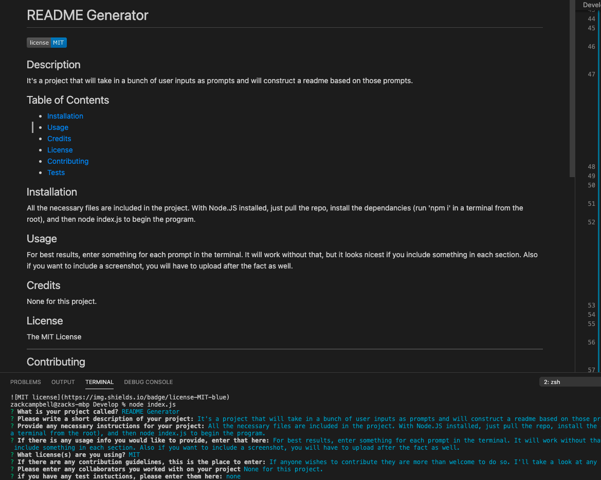

# README Generator
  
  ## Description
  It's a project that will take in a bunch of user inputs as prompts and will construct a readme based on those prompts.
  

  ## Table of Contents 
  - [Installation](#installation)
  - [Usage](#usage)
  - [Credits](#credits)
  - [License](#license)
  - [Contributing](#contributing)
  - [Tests](#tests)
  
  ## Installation
  All the necessary files are included in the project. With Node.JS installed, just pull the repo, install the dependancies (run 'npm i' in a terminal from the root), and then node index.js to begin the program.
  ## Usage
  For best results, enter something for each prompt in the terminal. It will work without that, but it looks nicest if you include something in each section. Also if you want to include a screenshot, you will have to upload after the fact as well, as I have below:
  
  
  ## Credits
  None for this project.
  ## License
 The MIT License

  ---
  
  ## Contributing
  If anyone wishes to contribute they are more than welcome to do so. I'll take a look at any pull request.
  ## Tests
  none
